> # **Dokumentacja LiveChecker - discord bot**

## Wstęp
---
🔴 LiveChecker to pomocnik dla twórców w internecie posiadających swój serwer na platformie discord. Pozwala on na śledzenie na żywo statystyk oraz tworzenie aktualnych powiadomień o nowych treściach na serwisach takich jak YouTube czy Twitch.

## Spis treści
---
- [Wstęp](#wstęp)
- [Spis treści](#spis-treści)
- [Najważniejsze rzeczy używane przez LiveChecker](#najważniejsze-rzeczy-używane-przez-livechecker)
- [Opracownie dokumentacji](#opracownie-dokumentacji)
- [Dodanie aplikacji na swój serwer discord](#dodanie-aplikacji-na-swój-serwer-discord)
- [Operacje dostępne dla społeczności](#operacje-dostępne-dla-społeczności)

<!-- - [Różne wersje językowe dokumentacji](#różne-wersje-językowe-dokumentacji) -->
<!-- ## Różne wersje językowe dokumentacji
---
| Język     | Odnośnik                 |
| --------- | ------------------------ |
| Angielski | [Przejdź](/README-EN.md) |
| Polski    | [Przejdź](/README-PL.md) | -->

## Najważniejsze rzeczy używane przez LiveChecker
---
Do poprawnego działania aplikacji wymagane jest wiele rzeczy, poniżej przedstawiamy najważniejsze z nich.
| Nazwa                                   |
| --------------------------------------- |
| node.js                                 |
| discord.js                              |
| MongoDB                                 |
| Axios                                   |
| API (Application Programming Interface) |

## Opracownie dokumentacji
---
| Imię i nazwisko    | Stanowisko       |
| ------------------ | ---------------- |
| Norbert Zawierucha | CEO, Programista |

# **Dodanie aplikacji na swój serwer discord**
Aby dodać naszą aplikację do swojego serwera discord, wystarczy, że [klikniesz tutaj](https://discord.com/oauth2/authorize?client_id=1064617399560699985&permissions=4398046511103&scope=bot%20applications.commands) - przeniesiemy Cię na stronę oficjalną discord'a. Wystarczy wybrać swój serwer discord z rozwijanej listy i kliknąć niebieski przycisk `Kontynuuj`, następnie zjechać na dół strony i potwierdzić kolejnym niebieskim przyciskiem `Autoryzuj`. Strona poprosi Cię o weryfikację czy jesteś człowiekiem. To tyle, już teraz zacznij konfiguracje na swoim serwerze.

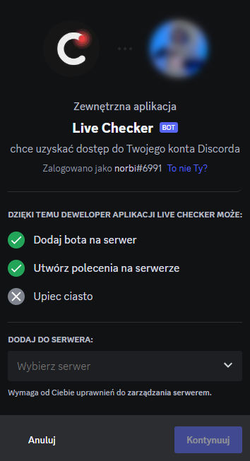

# **Operacje dostępne dla społeczności**
Wszystkie dostępne komendy wraz z ich opisem i wzorem użycia są możliwe do sprawdzenia za pomocą GUI discord'a. Po dodaniu aplikacji LiveChecker do własnego serwera w polu wpisywania tekstowego wystarczy wpisać prefix `/`, a następnie z wyświetlonej listy wybrać logo LiveChecker. Discord wyświetli pełną listę komend i ich pełną specyfikację. 

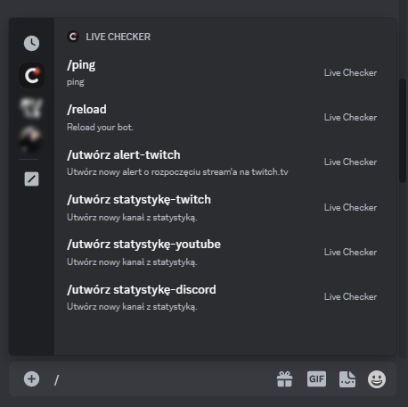

## Komenda - */utwórz alert-`platforma` `nazwa` `kanał`*
---
Utwórz nowy alert o nowej aktywności na wybranej platformie. Przy użyciu zmiennej `platforma` wybieramy interesującą nas platformę z proponowanych przez aplikację (np. twitch). Przy użyciu zmiennej `nazwa` podaj nazwę kanału (np. twitch.tv), do którego mają być wysyłane alerty. Natomiast przy użyciu zmiennej `kanał` wybierz kanał tekstowy, na który mają być wysyłane alerty. W przypadku zmiennej `kanał` wyświetli się nam lista z dostępnymi kanałami tekstowymi do wybrania. 

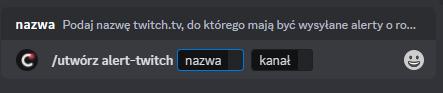

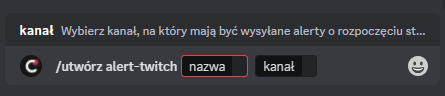

Przykładowe użycie:

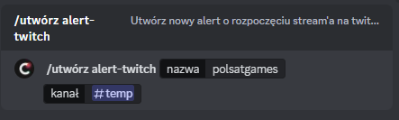

Po wysłaniu komendy bot po chwili zwróci informację o pobranych informacjach z odpowiedniego API. Przykładowy wygląd informacji zwrotnej:

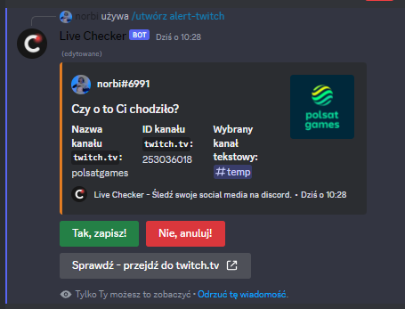

Za pomocą trzech przycisków możemy kolejno:
- `Tak, zapisz!` - potwierdzić zgodność danych i zapisać alert. Od tego momentu bot gdy wykryje nową aktywność (sprawdza średnio co minutę) na podanym kanale (np. twitch) wyświetli odpowiednią informiację na podanym kanale tekstowym. Aplikaja zwróci informację, przykładowa poniżej.

- `Nie, anuluj!` - anulować cały proces i zapisywanie alertu. Bot nie zapisze podanych informacji oraz nie wyświetli alertu w przypadku nowej aktywnośći na kanale (np. twitch). Aplikaja zwróci informację, przykładowa poniżej.

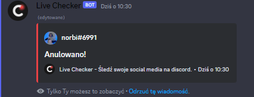

- `Sprawdź - przejdź do ...` - Otworzyć link w przeglądarce z pobranym przez aplikację kanałem (np. twitch). Bot ani nie anuluje, ani nie zapisze podanych informacji, będzie czekał (15 sekund) na użycie jednego z powyższych przycisków. Aplikacja przeniesie do domyślnej przeglądarki i otworzy link do kanału twitch.

- W przypadku przekroczenia czasu oczekiwania na informację zwrotną od użytkownika (15 sekund), bot anuluje cały proces i zapisywanie alertu -  nie zapisze podanych informacji oraz nie wyświetli alertu w przypadku nowej aktywności na kanale (np. twitch). Aplikaja zwróci informację, przykładowa poniżej.

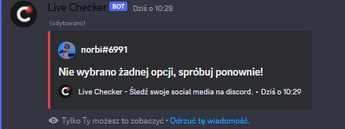

- W momencie wykrycia nowej aktywności na kanale (np. twitch) aplikacja pobierze wymagane dane z bazy danych oraz API platformy i wyświetli komunikat z najważniejszymi informacjami (w przypadku twitch.tv: nazwa oraz zdjęcie kanału twitch, tytuł oraz miniaturka transmisji na żywo). Przykładowy wygląd alertu:

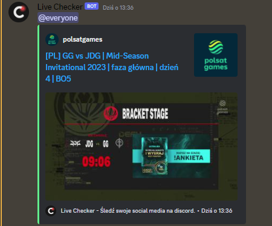

## Komenda - */utwórz statystkę-`platforma` `rodzaj` `nazwa`/`id`/`X` `tekst`*
---
Utwórz nowy kanał widoczny na liście wszystkich kanałów serwera z statystyką. Przy użyciu zmiennej `platforma` wybieramy interesującą nas platformę z proponowanych przez aplikację (np. discord, twitch, YouTube). Przy użyciu zmiennej `rodzaj` wybierz z listy rodzaj wyświetlanej statystyki. W zależności od wybranej platofmy przy użyciu zmiennej `nazwa`/`id`/`X` wymagane lub nie wymagane będzie podanie identyfikatora kanału, do którego mają być wyświetlane statystyki. Natomiast przy użyciu zmiennej `tekst` podaj tekst jaki ma wyświetlać się przed statystyką.

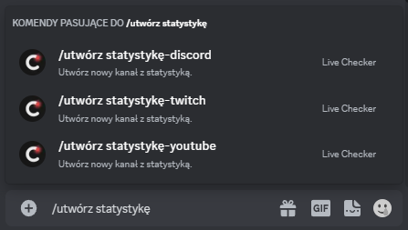

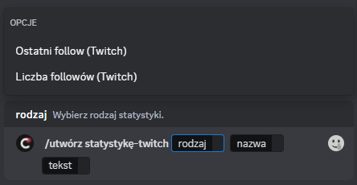

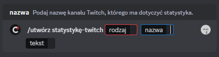

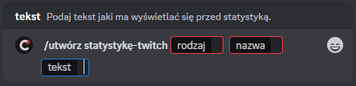

Przykładowe użycie:

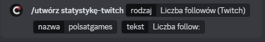

Po wysłaniu komendy bot utworzy nowy kanał głosowy i po chwili zwróci informację o pobranych informacjach z odpowiedniego API. Przykładowy wygląd informacji zwrotnej:

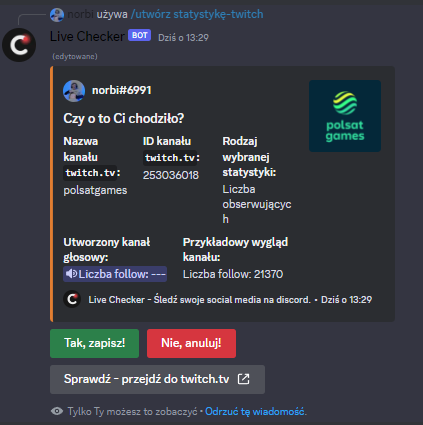

Za pomocą trzech przycisków możemy kolejno:
- `Tak, zapisz!` - potwierdzić zgodność danych i zapisać statystkę. Od tego momentu bot będzie aktualizował statystyki na utworzonym kanale (średnio co 5 minut).

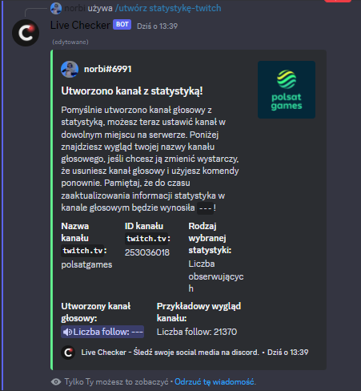

- `Nie, anuluj!` - anulować cały proces i zapisywanie statystyki. Bot nie zapisze podanych informacji oraz usunie utworzony kanał głosowy. Aplikaja zwróci informację, przykładowa poniżej.

- `Sprawdź - przejdź do ...` - Otworzyć link w przeglądarce z pobranym przez aplikację kanałem (np. twitch). Bot ani nie anuluje, ani nie zapisze podanych informacji, będzie czekał (15 sekund) na użycie jednego z powyższych przycisków. Aplikacja przeniesie do domyślnej przeglądarki i otworzy link do kanału twitch.

- W przypadku przekroczenia czasu oczekiwania na informację zwrotną od użytkownika (15 sekund), bot anuluje cały proces i zapisywanie statystyki -  nie zapisze podanych informacji oraz usunie utworzony kanał głosowy. Aplikaja zwróci informację, przykładowa poniżej.

- Bot średnio co 5 minut będzie pobierał i aktualizował statystyki na nowo utworzonym kanale głosowym. Możesz ręcznie przenieść kanał do wybranego przez siebie miejsca na swoim serwerze. Pamiętaj, że na ten kanał głosowy nie będzie mogła dołączyć żadna osoba (wyjątkiem są osoby mające do tego uprawnienia np. administracja lub przeniesienie ręczne na ten kanał).

 

## Akcja - *usuwanie alertu/statystyki*
---
Jeśli chcesz pozbyć się wysyłającego alertu lub statystyki wystarczy, że ręcznie usuniesz kanał przypisany do tej funkcji. Jest to najprostsza metoda na anulowanie istniejącej już funkcji, a w przyszłości planujemy stworzenie odpowiedniej komendy dla osób, które chcą zachować kanał.